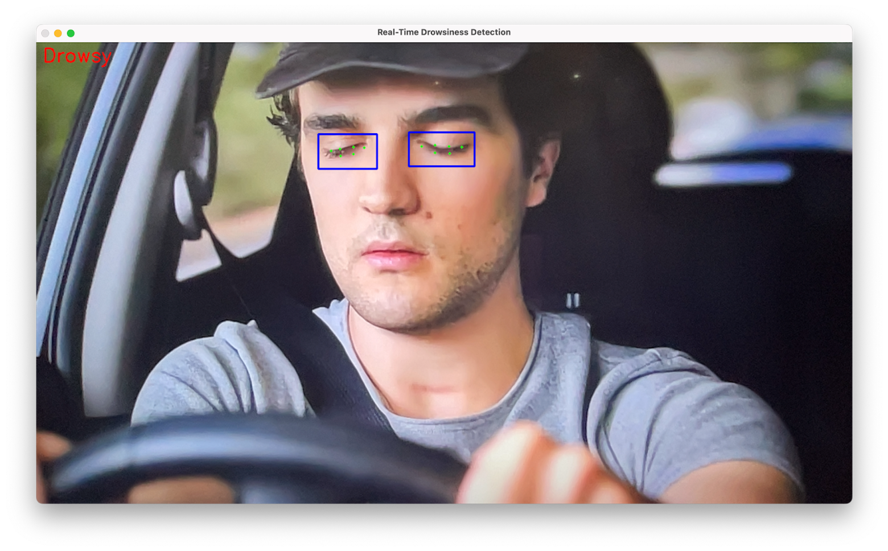

# **Patient-Specific Training of Deep Learning Models for Drowsiness Detection**

A deep learning-based system for real-time drowsiness detection, focusing on patient-specific data splitting and comparing facial and eye-region features across three pre-trained CNN architectures: **MobileNetV3Small**, **EfficientNetV2B0**, and **ResNet50**. The study determined that **eye-region detection was more suitable**, achieving higher accuracy compared to facial features, with **ResNet50 on the eye dataset achieving the highest accuracy of 97%**. Performance was also evaluated under varying levels of data augmentation to optimize real-world implementation.

---

## **Table of Contents**
1. [Features](#features)
2. [Datasets](#datasets)
3. [Installation](#installation)
4. [Usage](#usage)
5. [Methodology](#methodology)
6. [Results](#results)
7. [Contributing](#contributing)

---

## **Features**
- Patient-specific data splitting to ensure realistic evaluation and prevent leakage.
- Comparison of **eye-region** and **facial features** across three CNN architectures:
  - **MobileNetV3Small** 
  - **EfficientNetV2B0** 
  - **ResNet50** 
- Evaluation of augmentation effects at three levels: no augmentation, light augmentation, and intense augmentation.
- Real-time detection using webcam input, with a configurable alert system for prolonged drowsiness detection.

---

## **Results**
- **Best Dataset**: Eye-only images from the MRL Eye Dataset.
- **Best Model**: ResNet50, achieving 97% accuracy on eye-only images with no augmentation.
- **Feature Comparison**: Eye-region detection consistently outperformed facial feature detection across all CNN architectures.

### **Model Performance on Augmentation Levels**
- **No Augmentation**: High accuracy.
- **Light Augmentation**: Not much imporvment.
- **Intense Augmentation**: Limited gains, with risk of overfitting.

---

## **Datasets**
This project utilized two dataset types for analysis:

1. **Face Detection Datasets**:
   - [DD1 Dataset](https://universe.roboflow.com/mansingh/dd1-ufiyc)
2. **Eye Detection Dataset**:
   - [MRL Eye Dataset](https://www.kaggle.com/datasets/imadeddinedjerarda/mrl-eye-dataset)

---

## **Installation**
### **1. Create a Conda Environment**
1. Install Conda if you haven’t already. Follow the [Conda installation guide](https://docs.conda.io/projects/conda/en/latest/user-guide/install/index.html).
2. Create a new environment for the project:
   ```bash
   conda create -n drowsiness-detection python=3.10 -y
   conda activate drowsiness-detection
   ```

### **2. Install Dependencies**
Install the required dependencies explicitly:
```bash
pip install tensorflow==2.10.0
pip install keras==2.10.0
pip install opencv-python-headless==4.8.0.76
pip install dlib==19.24.0
pip install numpy==1.23.5
pip install pandas==1.5.3
pip install matplotlib==3.6.2
pip install scikit-learn==1.1.3
pip install imgaug==0.4.0
pip install jupyterlab==3.5.0
pip install tqdm==4.64.1
```

### **3. Clone the Repository**
Clone the project repository:
```bash
git clone https://github.com/Asma-MBZUAI/Drowsiness_Detection.git
cd Drowsiness_Detection/Patient-Specific_Training_of_Deep_Learning_Models_for_Drowsiness_Detection/
```

---

## **Usage**

### **Training the Model**
- **Eye Dataset:**  
  Use the `train_eyes_SmallDataset.ipynb` notebook to train the model on the eye dataset.

- **Face Dataset:**  
  Use the following notebooks to train the model on the face dataset:  
  - `Baseline.ipynb`  
  - `Intense Augmentation.ipynb`  
  - `Light Augmentation.ipynb`  

### **Real-Time Detection**
Execute the `real_time_detection.py` script for real-time detection:  
```bash
python real_time_detection.py
```
## **Real-Time Detection Results**
### **Not Drowsy Results**


### **Drowsy Results**

---

## **Contributing**
Contributions are welcome! To contribute:
1. Fork the repository.
2. Create a feature branch:
   ```bash
   git checkout -b feature-name
   ```
3. Commit and push your changes:
   ```bash
   git push origin feature-name
   ```
4. Open a pull request.

---

